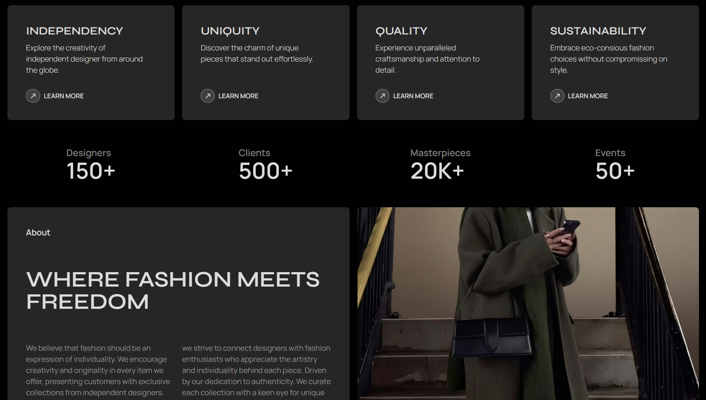

# 👗 DVSY – Diversity in Style

Modern, minimal fashion UI built with **React**, **Tailwind CSS (v4)**, and **Vite**. This practice project is now complete and showcases a dark-themed, premium aesthetic with reusable components and responsive layouts.

---

## 🔎 Overview

- Completed practice project focused on clean design and component-driven architecture.
- Dark, editorial look with strong typography and spacing.
- Pages and sections composed from modular components (e.g., `Navbar`, `Hero`, `Cards`, `Stats`, `About`, `Advantages`).

---

## 🛠 Tech Stack

- React 19
- Tailwind CSS 4
- Vite 7

---

## ✨ Features

- Dark & minimal fashion UI
- Fully responsive layouts
- Reusable, composable components
- Fast dev environment with Vite
- Clean typography and spacing system

---

## 🖼️ Preview

Below are two preview images from the project:




---

## 🚀 Getting Started

### Prerequisites
- Node.js and a package manager (`npm` or `pnpm`)

### Install & Run

```bash
npm install
npm run dev
```

### Build & Preview

```bash
npm run build
npm run preview
```

---
## 👤 Author

**Alok Kumar Yadav**  
Frontend Developer